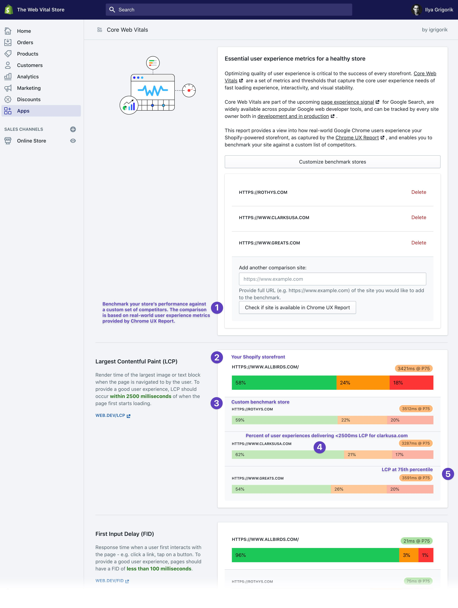

# Core Web Vitals (app) for Shopify

Optimizing quality of user experience is critical to the success of every storefront. [Core Web Vitals](https://blog.chromium.org/2020/05/introducing-web-vitals-essential-metrics.html) are a set of metrics and thresholds that capture the core user experience needs of fast loading experience, interactivity, and visual stability. Core Web Vitals are part of the upcoming [page experience signal](https://webmasters.googleblog.com/2020/05/evaluating-page-experience.html) for Google Search, are widely available across popular Google web developer tools, and can be tracked by every site owner both [in development and in production](https://web.dev/vitals-tools/).

**This embedded app provides a report on how real-world Google Chrome users experience the Shopify-powered storefront, as captured by the [Chrome UX Report](https://developers.google.com/web/tools/chrome-user-experience-report), and enables the site owner to benchmark their site against a custom list of competitors.**

Take it for a spin on your own **development** store: https://core-web-vitals-dashboard.herokuapp.com/login 

### Development

1. Install [Shopify CLI](https://shopify.github.io/shopify-app-cli/)
1. Install PostgreSQL
1. Bootstrap Rails environment:

   - `ruby-2.6.6` and `bundler` gem
   - `nodejs` and `webpacker` gem
   - `bundle install`
   - `rails db:prepare`

1. Launch the Rails app via `shopify serve`, optionally pass ENV variable to override the store origin for testing & development, e.g...
   `SHOPORIGIN='https://www.allbirds.com' shopify serve`
1. Navigate to the tunnel URL and install the dev app on your Shopify store

### Contributing

Have suggestions on how to improve the report, or a feature you'd like to nominate? Head to [Issues](/issues) and start the conversation.
